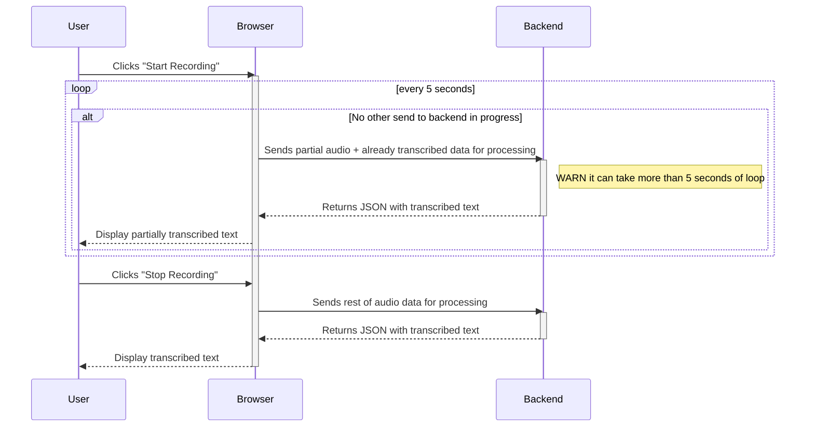

# AI whisper frontend

Just simple page which allows you to start recording process, stop it and will display transcribed text.

## Idea of partial processing 

Instead of sending whole audio at once would like to send partials.

Thanks to `mediaRecorder.requestData()` it is possible to achieve.

Definitely need to avoid situation
when multiple audio streams are send to transcribe in parallel as it can easily lead to dummy results.

It will be useful to send to backend already transcribed text to ensure it will generate continuation. 

